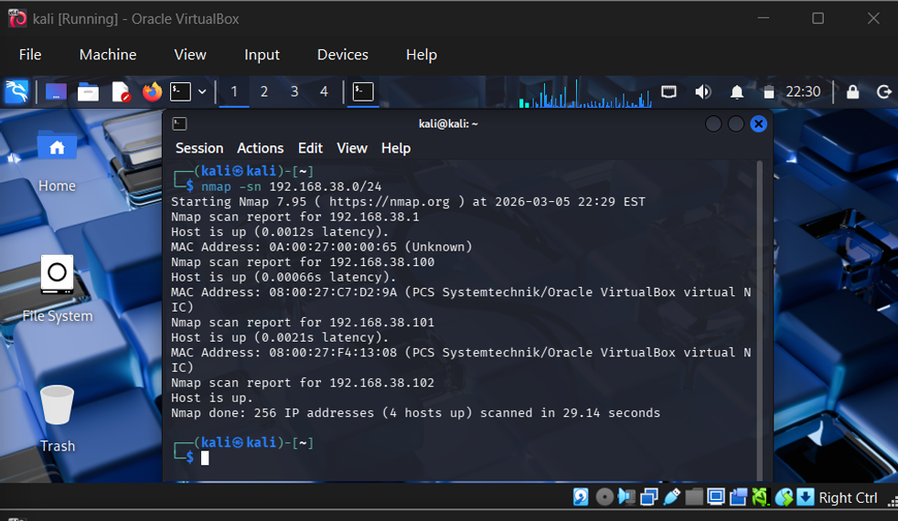
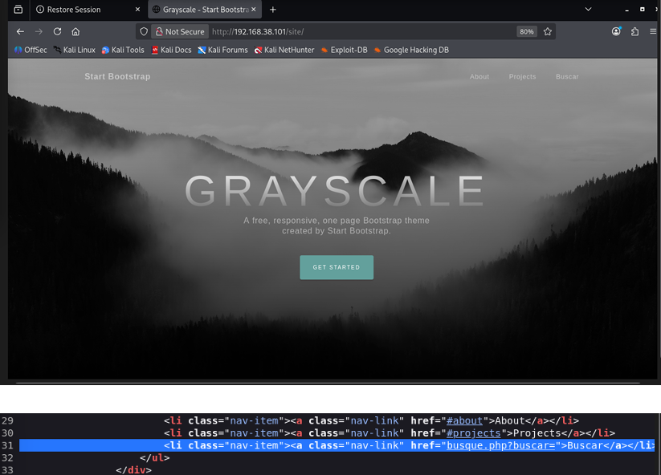
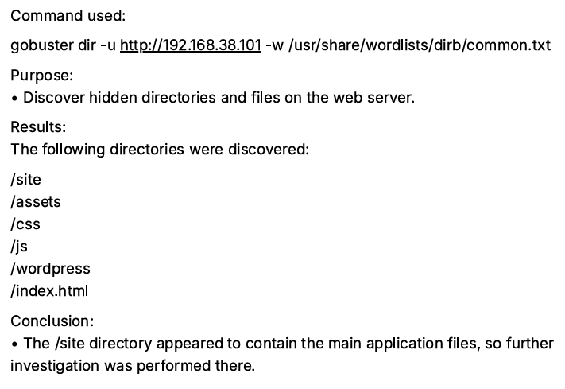
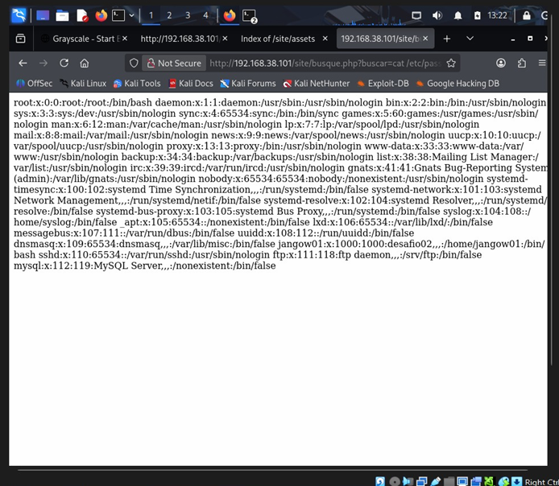

# JANGOW Web Penetration Test

## Overview

Conducted a web penetration-testing exercise against the deliberately
vulnerable JANGOW 1.0.1 machine in a controlled VirtualBox laboratory.

## Objective

The objective was to:

- Identify exposed services
- Enumerate the web application
- Discover hidden directories and files
- Identify web application vulnerabilities
- Validate the security impact of discovered weaknesses

## Lab Environment

- Attacker: Kali Linux
- Target: JANGOW 1.0.1
- Virtualization: VirtualBox
- Environment: Controlled educational laboratory

## Methodology

1. Network scanning
2. Service enumeration
3. Manual web exploration
4. Source-code inspection
5. Directory enumeration
6. Vulnerability identification
7. Command-injection validation
8. Impact analysis

## Tools

- Nmap
- Gobuster
- Firefox
- Kali Linux

## Network Scanning

Nmap was used to identify exposed ports and running services.

The scan identified HTTP running on the target, leading to further web
application enumeration.

## Web Enumeration

The web application was manually inspected and its source was analyzed to
identify parameters that processed user input.

Directory enumeration was then performed using Gobuster to identify
additional application paths and files.

## Vulnerability Identified

A command-injection vulnerability was identified in a web application
parameter that processed user-controlled input.

The vulnerability was validated in the controlled laboratory environment
through command execution.

## Impact

The vulnerability allowed operating-system commands to be executed through
the vulnerable parameter, demonstrating the potential impact of insufficient
input validation.

## Security Recommendations

- Validate and sanitize user input
- Avoid unsafe operating-system command execution
- Apply least-privilege principles
- Restrict application permissions
- Implement secure coding practices
- Perform regular security testing

## Key Takeaways

This lab provided practical experience with network reconnaissance, web
enumeration, directory discovery, source inspection, and vulnerability
validation.

## Disclaimer

All testing documented in this repository was performed against an
authorized, deliberately vulnerable educational laboratory environment.

## Evidence

### 1. Nmap Scan

Initial network scanning was performed to identify exposed services on the
target machine.

### 2. Web Application Enumeration

The web application was manually inspected and its source was analyzed to
identify input parameters and potential attack surfaces.

### 3. Directory Enumeration

Gobuster was used to discover directories and files exposed by the web
application.

### 4. Command Injection Validation

The identified input parameter was tested and command execution was validated
within the controlled laboratory environment.

